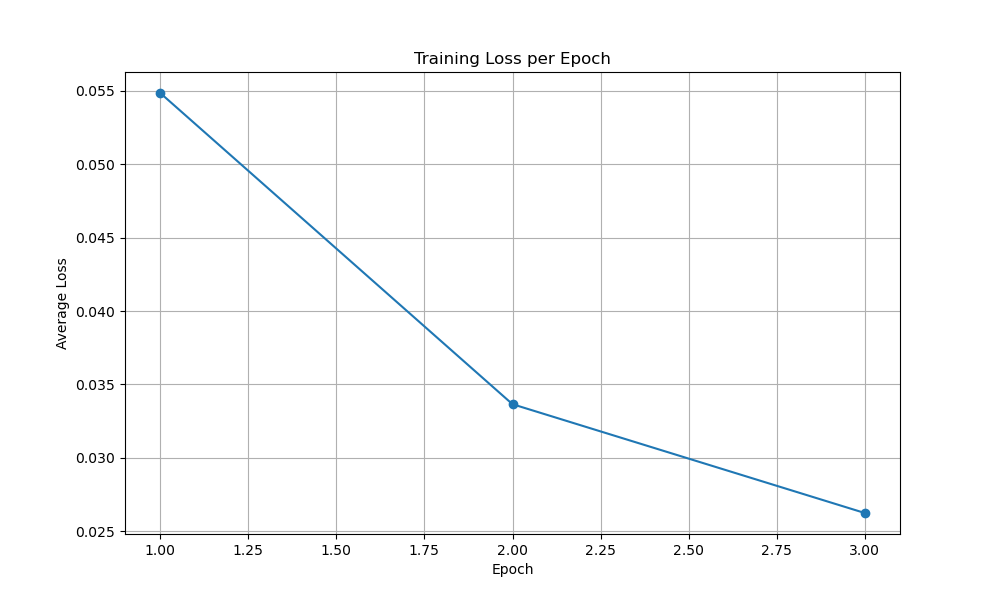

# CNN from Scratch for MNIST Digit Recognition

## Project Overview

This is an educational project focused on building a complete Convolutional Neural Network (CNN) framework from scratch using only Python and NumPy. The primary goal is to understand the fundamental mathematics and algorithms behind deep learning, particularly what frameworks like PyTorch or TensorFlow do "behind the scenes."

The project culminates in a LeNet-5 style CNN that is trained to recognize handwritten digits from the MNIST dataset.

## Network Architecture and Design Philosophy

Our CNN is inspired by the classic LeNet-5 architecture, a pioneering convolutional network known for its effectiveness in digit recognition. This choice was deliberate for its balance of simplicity and performance, making it an ideal candidate for a from-scratch implementation aimed at understanding fundamental principles.\n\n**Key Design Principles:**\n\n*   **Hierarchical Feature Learning:** Convolutional layers are designed to automatically learn spatial hierarchies of features, starting from simple patterns (edges, corners) in early layers to more complex, abstract representations in deeper layers.\n*   **Parameter Sharing:** Convolutional filters are applied across the entire image, allowing the network to detect the same feature regardless of its position. This significantly reduces the number of parameters compared to fully connected networks, making the model more efficient and less prone to overfitting.\n*   **Translational Invariance:** Pooling layers (specifically Max Pooling) introduce a degree of translational invariance, meaning the network can recognize an object even if its position shifts slightly within the image.\n*   **Non-linearity:** Activation functions (ReLU) are crucial for enabling the network to learn complex, non-linear relationships within the data, which linear models cannot capture.\n*   **Dimensionality Reduction:** Pooling layers and subsequent fully connected layers progressively reduce the spatial dimensions and consolidate features, preparing the data for final classification.\n\n**Adaptability to Other Applications:**\n\nWhile this project focuses on digit recognition, the core principles of CNNs are highly adaptable to a wide range of computer vision tasks:\n\n*   **Image Classification:** Identifying the primary object or scene in an image (e.g., cat vs. dog, different types of vehicles).\n*   **Object Detection:** Locating and classifying multiple objects within an image by drawing bounding boxes around them (e.g., self-driving cars identifying pedestrians, traffic signs).\n*   **Image Segmentation:** Classifying each pixel in an image to delineate object boundaries precisely (e.g., medical image analysis, autonomous driving lane detection).\n*   **Generative Models:** Creating new images that resemble the training data (e.g., Generative Adversarial Networks for realistic face generation).\n*   **Transfer Learning:** Leveraging pre-trained CNNs (trained on massive datasets like ImageNet) as powerful feature extractors for new, related tasks with smaller datasets, significantly reducing training time and data requirements.\n\nFor a detailed breakdown of our specific CNN architecture, including layer-by-layer specifications and the rationale behind each component, please refer to the [Training the CNN on MNIST](./docs/train_cnn.md) documentation.\n
## Features

This repository contains a from-scratch implementation of:

*   **Neural Network Layers:**
    *   `Dense` (Fully Connected)
    *   `Convolutional` (using `im2col` for performance)
    *   `MaxPooling`
    *   `Flatten`
    *   `ReLU`, `Sigmoid`, and `Softmax` Activations
*   **Loss Functions:**
    *   `MeanSquaredError`
    *   `CategoricalCrossEntropy`
*   **Network Orchestration:**
    *   A `Network` class to build sequential models.
    *   A `train` method implementing mini-batch Stochastic Gradient Descent (SGD).
    *   Functionality to save and load trained model parameters.
*   **Testing and Documentation:**
    *   Unit tests for each layer, including numerical gradient checking.
    *   Detailed documentation in the `/docs` directory explaining the core concepts, mathematical derivations, and code structure.

## Project Structure

```
.
├── docs/                 # Detailed documentation for concepts and classes.
├── models/               # Saved model parameters.
├── src/                  # Core library code for the neural network.
│   ├── __init__.py
│   ├── layers.py
│   ├── losses.py
│   └── network.py
├── tests/                # Unit tests for each component.
├── test_reports/         # Detailed reports from running the test suite.
├── preprocess_mnist.py   # Script to download and preprocess MNIST data.
├── predict_mnist.py      # Script to load a trained model and make predictions.
└── train_mnist.py        # Main script to build, train, and evaluate the CNN.
```

## How to Use

### Prerequisites

*   Conda (Anaconda or Miniconda)

### Installation

1.  **Clone the Repository:**
    ```bash
    git clone https://github.com/kyleyhw/digit_recognition.git
    cd digit_recognition
    ```

2.  **Create and Activate the Conda Environment:**
    This command creates a new Conda environment named `digit_recognition` with all the necessary libraries specified in the `environment.yml` file.
    ```bash
    conda env create -f environment.yml
    conda activate digit_recognition
    ```

### 1. Prepare the Data

To download the raw MNIST data, process it, and save it as compressed `.npz` files for faster loading, run the following command. This script is idempotent and will only download or process files if they don't already exist.

```bash
python preprocess_mnist.py
```

### 2. Train the Model

To train the CNN on the full MNIST dataset, run the main training script. **Note:** This will take a significant amount of time.

```bash
python train_mnist.py
```

After training is complete, the learned model parameters will be saved to a file named `mnist_cnn.npz`.

### 3. Make Predictions with the Trained Model

Once the model is trained and `mnist_cnn.npz` exists, you can quickly run predictions on the test set without retraining:

```bash
python predict_mnist.py
```

This script will load the saved parameters and evaluate the model's accuracy.

---

## Training Progress

Below is a plot illustrating the training loss over epochs. A decreasing trend indicates that the network is learning and its predictions are becoming more accurate over time.



---

## Documentation Hub

This project is designed to be an educational resource. The documentation below will walk you through the fundamental theory and implementation of a convolutional neural network, assuming no prior background in machine learning.

### Table of Contents

Follow these documents in order for a comprehensive understanding.

1.  **[Fundamental Concepts](./docs/concepts.md)**
    *   Start here if you are new to machine learning. This document explains the core ideas and terminology, such as what a neural network is, what a "loss function" means, and the basic idea behind "training."

2.  **[The Layers Explained](./docs/layers_explained.md)**
    *   A deep dive into each type of layer we built. For each one, we explain its purpose, the mathematics of its forward and backward passes, and show how the math is translated directly into the code in `src/layers.py`.

3.  **[Loss Functions](./docs/loss_functions.md)**
    *   Learn how we measure the network's performance. This document details the Mean Squared Error and Categorical Cross-Entropy loss functions, including their mathematical derivations and code implementation.

4.  **[The Network Class](./docs/network_class.md)**
    *   Understand the orchestrator of the whole process. This document explains how the `Network` class holds the layers together and manages the training and prediction logic.

5.  **[Training the CNN on MNIST](./docs/train_cnn.md)**
    *   See how all the pieces come together. This document breaks down the final `train_mnist.py` script, explaining the specific architecture of our digit-recognizing CNN and how we train and evaluate it.
