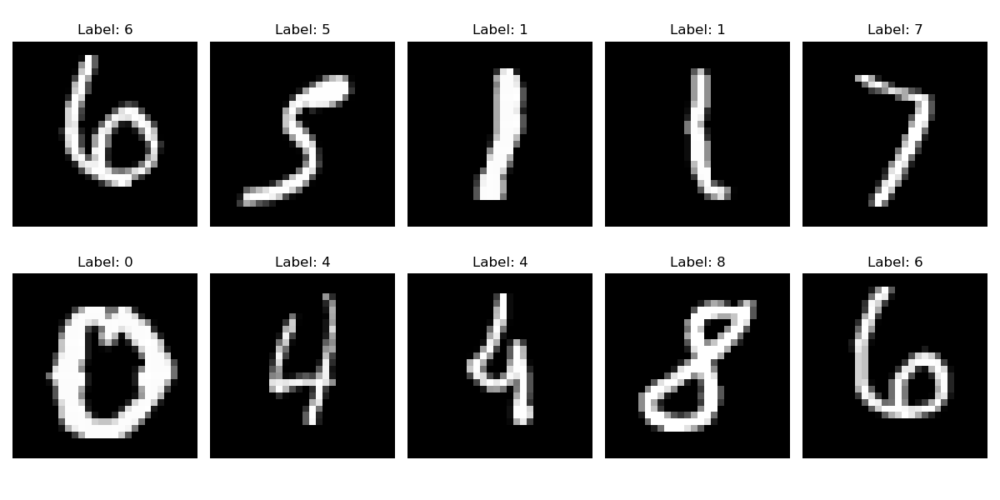
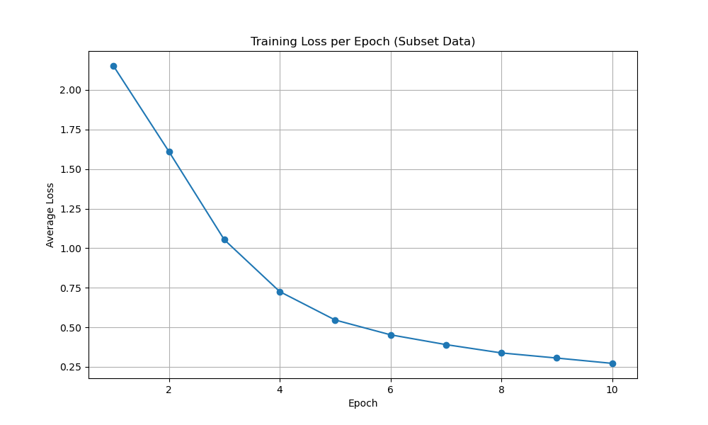
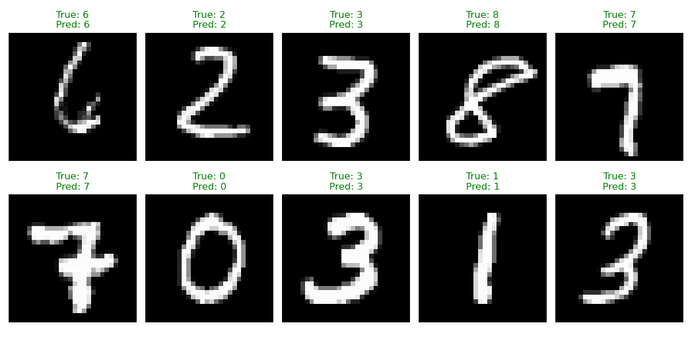

# CNN from Scratch for MNIST Digit Recognition

## Project Overview

This is an educational project focused on building a complete Convolutional Neural Network (CNN) framework from scratch using only Python and NumPy. The primary goal is to understand the fundamental mathematics and algorithms behind deep learning, particularly what frameworks like PyTorch or TensorFlow do "behind the scenes."

The project culminates in a LeNet-5 style CNN that is trained to recognize handwritten digits from the MNIST dataset.

## Network Architecture and Design Philosophy

Our CNN is inspired by the classic LeNet-5 architecture, a pioneering convolutional network known for its effectiveness in digit recognition. This choice was deliberate for its balance of simplicity and performance, making it an ideal candidate for a from-scratch implementation aimed at understanding fundamental principles.

**Key Design Principles:**

*   **Hierarchical Feature Learning:** Convolutional layers are designed to automatically learn spatial hierarchies of features, starting from simple patterns (edges, corners) in early layers to more complex, abstract representations in deeper layers.
*   **Parameter Sharing:** Convolutional filters are applied across the entire image, allowing the network to detect the same feature regardless of its position. This significantly reduces the number of parameters compared to fully connected networks, making the model more efficient and less prone to overfitting.
*   **Translational Invariance:** Pooling layers (specifically Max Pooling) introduce a degree of translational invariance, meaning the network can recognize an object even if its position shifts slightly within the image.
*   **Non-linearity:** Activation functions (ReLU) are crucial for enabling the network to learn complex, non-linear relationships within the data, which linear models cannot capture.
*   **Dimensionality Reduction:** Pooling layers and subsequent fully connected layers progressively reduce the spatial dimensions and consolidate features, preparing the data for final classification.

**Adaptability to Other Applications:**

While this project focuses on digit recognition, the core principles of CNNs are highly adaptable to a wide range of computer vision tasks:

*   **Image Classification:** Identifying the primary object or scene in an image (e.g., cat vs. dog, different types of vehicles).
*   **Object Detection:** Locating and classifying multiple objects within an image by drawing bounding boxes around them (e.g., self-driving cars identifying pedestrians, traffic signs).
*   **Image Segmentation:** Classifying each pixel in an image to delineate object boundaries precisely (e.g., medical image analysis, autonomous driving lane detection).
*   **Generative Models:** Creating new images that resemble the training data (e.g., Generative Adversarial Networks for realistic face generation).
*   **Transfer Learning:** Leveraging pre-trained CNNs (trained on massive datasets like ImageNet) as powerful feature extractors for new, related tasks with smaller datasets, significantly reducing training time and data requirements.

For a detailed breakdown of our specific CNN architecture, including layer-by-layer specifications and the rationale behind each component, please refer to the [Training the CNN on MNIST](./docs/train_cnn.md) documentation.\n
## Features

This repository contains a from-scratch implementation of:

*   **Neural Network Layers:**
    *   `Dense` (Fully Connected)
    *   `Convolutional` (using `im2col` for performance)
    *   `MaxPooling`
    *   `Flatten`
    *   `ReLU`, `Sigmoid`, and `Softmax` Activations
*   **Loss Functions:**
    *   `MeanSquaredError`
    *   `CategoricalCrossEntropy`
*   **Network Orchestration:**
    *   A `Network` class to build sequential models.
    *   A `train` method implementing mini-batch Stochastic Gradient Descent (SGD).
    *   Functionality to save and load trained model parameters.
*   **Testing and Documentation:**
    *   Unit tests for each layer, including numerical gradient checking.
    *   Detailed documentation in the `/docs` directory explaining the core concepts, mathematical derivations, and code structure.

## Project Structure

```
.
├── checkpoints/         # Saved model checkpoints during training.
├── docs/                 # Detailed documentation for concepts and classes.
├── models/               # Saved final model parameters.
├── src/                  # Core library code for the neural network.
│   ├── __init__.py
│   ├── layers.py
│   ├── losses.py
│   └── network.py
├── tests/                # Unit tests for each component.
├── test_reports/         # Detailed reports from running the test suite.
├── preprocess_mnist.py   # Script to download and preprocess MNIST data.
├── predict_mnist.py      # Script to load a trained model and make predictions.
└── train_mnist.py        # Main script to build, train, and evaluate the CNN.
```

## Showcasing Model Capabilities

To effectively showcase the capabilities of this Convolutional Neural Network, you can utilize the interactive GUI and the prediction script:

### 1. Interactive GUI (`gui_predictor.py`)

This provides a real-time, hands-on experience of the CNN's digit recognition abilities.

*   **How to Use:**
    1.  Ensure you have a trained model (e.g., by running `train_mnist.py` at least once).
    2.  Execute the GUI script: `python gui_predictor.py`
    3.  A window will appear with a black canvas. Use your mouse to draw a digit (0-9).
    4.  Observe the "Prediction" label and the confidence bars on the right. The network will update its prediction and confidence levels in real-time as you draw.
    5.  Click the "Clear" button to erase your drawing and try another digit.

*   **What it Demonstrates:**
    *   **Real-time Inference:** The network's ability to classify handwritten digits instantly.
    *   **Robustness:** How well the model handles variations in handwriting style, thickness, and placement (thanks to the preprocessing steps).
    *   **Confidence Levels:** The probabilistic output of the network, showing its certainty for each digit class.

### 2. Prediction Script (`predict_mnist.py`)

This script evaluates the trained model on a portion of the unseen test dataset and provides both quantitative and qualitative insights into its performance.

*   **How to Use:**
    1.  Ensure you have a trained model (e.g., `models/mnist_cnn_full_dataset.npz`).
    2.  Execute the prediction script: `python predict_mnist.py`
    3.  The script will print the overall test accuracy and save a visualization of sample predictions.

*   **What it Demonstrates:**
    *   **Generalization:** The model's performance on data it has never seen before.
    *   **Accuracy:** The quantitative measure of how often the model makes correct predictions.
    *   **Visual Examples:** The `Prediction Examples` plot (found in the [Visualizations](#visualizations) section below) shows specific instances of correct and incorrect classifications, allowing for qualitative assessment of the model's strengths and weaknesses.

---

## Getting Started: Setup and Training

### Prerequisites

*   Conda (Anaconda or Miniconda)

### Installation

1.  **Clone the Repository:**
    ```bash
    git clone https://github.com/kyleyhw/digit_recognition.git
    cd digit_recognition
    ```

2.  **Create and Activate the Conda Environment:**
    This command creates a new Conda environment named `digit_recognition` with all the necessary libraries specified in the `environment.yml` file.
    ```bash
    conda env create -f environment.yml
    conda activate digit_recognition
    ```

### 1. Prepare the Data

To download the raw MNIST data, process it, and save it as compressed `.npz` files for faster loading, run the following command. This script is idempotent and will only download or process files if they don't already exist.

```bash
python preprocess_mnist.py
```

### 2. Train the Model

To train the CNN on the full MNIST dataset, run the main training script. **Note:** This will take a significant amount of time.

```bash
python train_mnist.py
```

After training is complete, the learned model parameters will be saved to a file named `mnist_cnn.npz`.

### 3. Make Predictions with the Trained Model

Once the model is trained and `mnist_cnn.npz` exists, you can quickly run predictions on the test set without retraining:

```bash
python predict_mnist.py
```

This script will load the saved parameters and evaluate the model's accuracy.

---

## Visualizations

To provide a clearer understanding of the data and the model's performance, we include several visualizations:

### Sample Data Visuals

Below are a few random samples from the MNIST training dataset, showcasing the diversity of handwritten digits that our CNN learns to recognize. This plot helps to visualize the raw input data the model processes.



### Training Progress: Loss Plots

This plot illustrates the training loss over epochs when the model is trained on a small subset of the MNIST data. This approach is taken in the interest of runtime for demonstration purposes, allowing for quicker experimentation and verification of the training setup.

**Understanding the Loss Value (Categorical Cross-Entropy):**

The loss value, specifically Categorical Cross-Entropy (CCE) in this project, quantifies the discrepancy between the model's predicted probability distribution and the true probability distribution (the actual label).

*   **Intuitive Meaning:**
    *   **High Loss:** Means the model is very "surprised" by the correct answer. For example, if the true digit is '7' but the model predicted '1' with high confidence, the loss will be very high.
    *   **Low Loss:** Means the model's predicted probability for the correct class is high, and it's not "surprised" by the true answer.
    *   **Perfect Prediction (Loss = 0):** If the model predicts the correct class with 100% certainty (probability 1.0), the CCE loss for that sample would be 0.

*   **Interpreting Absolute Values:**
    *   **Loss of ~2.3:** For a 10-class classification problem, if the model were predicting purely randomly (i.e., 10% chance for each class), the CCE loss would be approximately $-\log(0.1) \approx 2.3$. So, a loss value around 2.3 or higher at the beginning of training indicates the model is essentially guessing or performing worse than random.
    *   **Loss of ~0.0 - 0.5 (or lower):** A loss in this range typically indicates that the model is performing very well, assigning high probabilities to the correct classes. The closer to 0, the more confident and accurate the model is.

*   **Trend is Key:** While absolute values provide context, the *trend* of the loss curve is most important:
    *   **Decreasing Trend:** This is what we want to see. It signifies that the model is learning and improving its predictions over time.
    *   **Stagnant or Oscillating Trend:** Could indicate issues like a learning rate that's too low (stagnant) or too high (oscillating), or that the model has reached its learning capacity.
    *   **Increasing Trend:** A clear sign of problems, often due to a learning rate that is too high, causing the model to diverge.



### Prediction Examples

Here, we visualize several test images along with their true labels and the model's predictions. Correct predictions are marked in green, while incorrect ones are in red. This visual allows for a qualitative assessment of the model's generalization capabilities and helps identify specific digits or styles that the model might struggle with.



---

# CNN from Scratch for MNIST Digit Recognition

## Project Overview

This is an educational project focused on building a complete Convolutional Neural Network (CNN) framework from scratch using only Python and NumPy. The primary goal is to understand the fundamental mathematics and algorithms behind deep learning, particularly what frameworks like PyTorch or TensorFlow do "behind the scenes." [3]

The project culminates in a LeNet-5 style CNN [1] that is trained to recognize handwritten digits from the MNIST dataset [2].

## Network Architecture and Design Philosophy

Our CNN is inspired by the classic LeNet-5 architecture [1], a pioneering convolutional network known for its effectiveness in digit recognition. This choice was deliberate for its balance of simplicity and performance, making it an ideal candidate for a from-scratch implementation aimed at understanding fundamental principles.

**Key Design Principles:**

*   **Hierarchical Feature Learning:** Convolutional layers are designed to automatically learn spatial hierarchies of features, starting from simple patterns (edges, corners) in early layers to more complex, abstract representations in deeper layers [3].
*   **Parameter Sharing:** Convolutional filters are applied across the entire image, allowing the network to detect the same feature regardless of its position. This significantly reduces the number of parameters compared to fully connected networks, making the model more efficient and less prone to overfitting [3].
*   **Translational Invariance:** Pooling layers (specifically Max Pooling) introduce a degree of translational invariance, meaning the network can recognize an object even if its position shifts slightly within the image [3].
*   **Non-linearity:** Activation functions (ReLU) are crucial for enabling the network to learn complex, non-linear relationships within the data, which linear models cannot capture [3].
*   **Dimensionality Reduction:** Pooling layers and subsequent fully connected layers progressively reduce the spatial dimensions and consolidate features, preparing the data for final classification [3].

**Adaptability to Other Applications:**

While this project focuses on digit recognition, the core principles of CNNs are highly adaptable to a wide range of computer vision tasks [3]:

*   **Image Classification:** Identifying the primary object or scene in an image (e.g., cat vs. dog, different types of vehicles).
*   **Object Detection:** Locating and classifying multiple objects within an image by drawing bounding boxes around them (e.g., self-driving cars identifying pedestrians, traffic signs).
*   **Image Segmentation:** Classifying each pixel in an image to delineate object boundaries precisely (e.g., medical image analysis, autonomous driving lane detection).
*   **Generative Models:** Creating new images that resemble the training data (e.g., Generative Adversarial Networks for realistic face generation).
*   **Transfer Learning:** Leveraging pre-trained CNNs (trained on massive datasets like ImageNet) as powerful feature extractors for new, related tasks with smaller datasets, significantly reducing training time and data requirements.

For a detailed breakdown of our specific CNN architecture, including layer-by-layer specifications and the rationale behind each component, please refer to the [Training the CNN on MNIST](./docs/train_cnn.md) documentation.\n
## Features

This repository contains a from-scratch implementation of:

*   **Neural Network Layers:**
    *   `Dense` (Fully Connected)
    *   `Convolutional` (using `im2col` for performance)
    *   `MaxPooling`
    *   `Flatten`
    *   `ReLU`, `Sigmoid`, and `Softmax` Activations
*   **Loss Functions:**
    *   `MeanSquaredError`
    *   `CategoricalCrossEntropy`
*   **Network Orchestration:**
    *   A `Network` class to build sequential models.
    *   A `train` method implementing mini-batch Stochastic Gradient Descent (SGD).
    *   Functionality to save and load trained model parameters.
*   **Testing and Documentation:**
    *   Unit tests for each layer, including numerical gradient checking.
    *   Detailed documentation in the `/docs` directory explaining the core concepts, mathematical derivations, and code structure.

## Project Structure

```
.
├── checkpoints/         # Saved model checkpoints during training.
├── docs/                 # Detailed documentation for concepts and classes.
├── models/               # Saved final model parameters.
├── src/                  # Core library code for the neural network.
│   ├── __init__.py
│   ├── layers.py
│   ├── losses.py
│   └── network.py
├── tests/                # Unit tests for each component.
├── test_reports/         # Detailed reports from running the test suite.
├── preprocess_mnist.py   # Script to download and preprocess MNIST data.
├── predict_mnist.py      # Script to load a trained model and make predictions.
└── train_mnist.py        # Main script to build, train, and evaluate the CNN.
```

## Showcasing Model Capabilities

To effectively showcase the capabilities of this Convolutional Neural Network, you can utilize the interactive GUI and the prediction script:

### 1. Interactive GUI (`gui_predictor.py`)

This provides a real-time, hands-on experience of the CNN's digit recognition abilities.

*   **How to Use:**
    1.  Ensure you have a trained model (e.g., by running `train_mnist.py` at least once).
    2.  Execute the GUI script: `python gui_predictor.py`
    3.  A window will appear with a black canvas. Use your mouse to draw a digit (0-9).
    4.  Observe the "Prediction" label and the confidence bars on the right. The network will update its prediction and confidence levels in real-time as you draw.
    5.  Click the "Clear" button to erase your drawing and try another digit.

*   **What it Demonstrates:**
    *   **Real-time Inference:** The network's ability to classify handwritten digits instantly.
    *   **Robustness:** How well the model handles variations in handwriting style, thickness, and placement (thanks to the preprocessing steps).
    *   **Confidence Levels:** The probabilistic output of the network, showing its certainty for each digit class.

### 2. Prediction Script (`predict_mnist.py`)

This script evaluates the trained model on a portion of the unseen test dataset and provides both quantitative and qualitative insights into its performance.

*   **How to Use:**
    1.  Ensure you have a trained model (e.g., `models/mnist_cnn_full_dataset.npz`).
    2.  Execute the prediction script: `python predict_mnist.py`
    3.  The script will print the overall test accuracy and save a visualization of sample predictions.

*   **What it Demonstrates:**
    *   **Generalization:** The model's performance on data it has never seen before.
    *   **Accuracy:** The quantitative measure of how often the model makes correct predictions.
    *   **Visual Examples:** The `Prediction Examples` plot (found in the [Visualizations](#visualizations) section below) shows specific instances of correct and incorrect classifications, allowing for qualitative assessment of the model's strengths and weaknesses.

---

## Getting Started: Setup and Training

### Prerequisites

*   Conda (Anaconda or Miniconda)

### Installation

1.  **Clone the Repository:**
    ```bash
    git clone https://github.com/kyleyhw/digit_recognition.git
    cd digit_recognition
    ```

2.  **Create and Activate the Conda Environment:**
    This command creates a new Conda environment named `digit_recognition` with all the necessary libraries specified in the `environment.yml` file.
    ```bash
    conda env create -f environment.yml
    conda activate digit_recognition
    ```

### 1. Prepare the Data

To download the raw MNIST data, process it, and save it as compressed `.npz` files for faster loading, run the following command. This script is idempotent and will only download or process files if they don't already exist.

```bash
python preprocess_mnist.py
```

### 2. Train the Model

To train the CNN on the full MNIST dataset, run the main training script. **Note:** This will take a significant amount of time.

```bash
python train_mnist.py
```

After training is complete, the learned model parameters will be saved to a file named `mnist_cnn.npz`.

### 3. Make Predictions with the Trained Model

Once the model is trained and `mnist_cnn.npz` exists, you can quickly run predictions on the test set without retraining:

```bash
python predict_mnist.py
```

This script will load the saved parameters and evaluate the model's accuracy.

---

## Visualizations

To provide a clearer understanding of the data and the model's performance, we include several visualizations:

### Sample Data Visuals

Below are a few random samples from the MNIST training dataset, showcasing the diversity of handwritten digits that our CNN learns to recognize. This plot helps to visualize the raw input data the model processes.


### Training Progress: Loss Plots

This plot illustrates the training loss over epochs when the model is trained on a small subset of the MNIST data. This approach is taken in the interest of runtime for demonstration purposes, allowing for quicker experimentation and verification of the training setup. A consistently decreasing loss indicates that the model is effectively learning from the data and its predictions are improving over time.


### Prediction Examples

Here, we visualize several test images along with their true labels and the model's predictions. Correct predictions are marked in green, while incorrect ones are in red. This visual allows for a qualitative assessment of the model's generalization capabilities and helps identify specific digits or styles that the model might struggle with.


---

## Documentation Hub

This project is designed to be an educational resource. The documentation below will walk you through the fundamental theory and implementation of a convolutional neural network, assuming no prior background in machine learning.

### Table of Contents

Follow these documents in order for a comprehensive understanding.

1.  **[Fundamental Concepts](./docs/concepts.md)**
    *   Start here if you are new to machine learning. This document explains the core ideas and terminology, such as what a neural network is, what a "loss function" means, and the basic idea behind "training."

2.  **[The Layers Explained](./docs/layers_explained.md)**
    *   A deep dive into each type of layer we built. For each one, we explain its purpose, the mathematics of its forward and backward passes, and show how the math is translated directly into the code in `src/layers.py`.

3.  **[Loss Functions](./docs/loss_functions.md)**
    *   Learn how we measure the network's performance. This document details the Mean Squared Error and Categorical Cross-Entropy loss functions, including their mathematical derivations and code implementation.

4.  **[The Network Class](./docs/network_class.md)**
    *   Understand the orchestrator of the whole process. This document explains how the `Network` class holds the layers together and manages the training and prediction logic.

5.  **[Training the CNN on MNIST](./docs/train_cnn.md)**
    *   See how all the pieces come together. This document breaks down the final `train_mnist.py` script, explaining the specific architecture of our digit-recognizing CNN and how we train and evaluate it.

6.  **[GUI Predictor Documentation](./docs/gui_predictor.md)**
    *   Explore the interactive graphical user interface that allows you to draw digits and see real-time predictions from the trained CNN, including details on image preprocessing and confidence display.

## References

[1] LeCun, Y., Bottou, L., Bengio, Y., & Haffner, P. (1998). Gradient-based learning applied to document recognition. *Proceedings of the IEEE*, 86(11), 2278-2324.
[2] LeCun, Y., & Cortes, C. (1998). The MNIST database of handwritten digits.
[3] Goodfellow, I., Bengio, Y., & Courville, A. (2016). *Deep Learning*. MIT Press.
